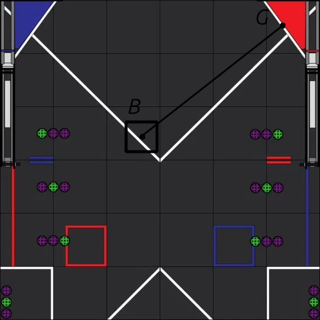
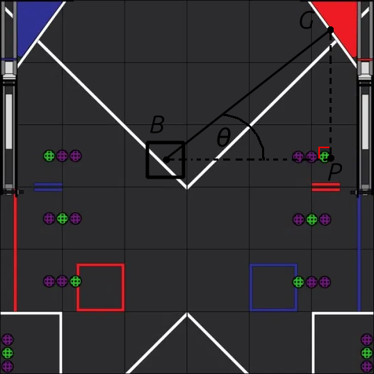

## Bot aim
Given the bot's pose and the goal's pose, what should the bot's heading be to be able to score?

For brevity, call the bot's pose $B$ and the goal's pose $G$. Then, our desired heading, $\theta$, is the angle at which the bot is *perpendicular* to the goal. 

Since we want the angle to the horizontal, let $P$ be the point with coordinates $(G_x, B_y)$, forming a right-angled triangle. 

Hence, we can use trigonometry to find $\theta$:

$$\tan\theta = \frac{\text{Opp}}{\text{Adj}}$$

Then, calculate the length of the opposite, $\text{Opp}$, and the adjacent, $\text{Adj}$:

$$\begin{align}
& \text{Opp} = |G_y - B_y| \\
& \text{Adj} = |G_x - B_x| \\
\end{align}$$

Hence,

$$\theta = \arctan\left(\frac{|G_y - B_y|}{|G_x - B_x|}\right) $$

However, when $B_x > G_x$, then the heading must be corrected as $180^\circ - \theta$, since the triangle will be mirrored. 

