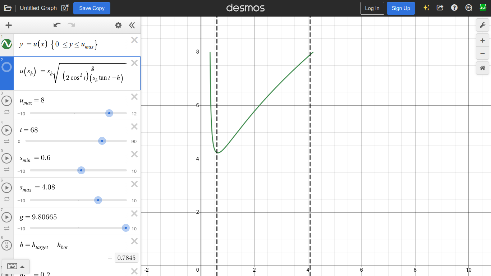

# Shooter design: Change-mechmasters (FTC18494-FTC25102)
Initially, we considered using a (stationary) flywheel-based shooter mechanism as our scoring mechanism. To assess whether such a design would be successful, and to design it such that it would be effective & accurate, we had to consider the mathematical & physics principles behind it.

## Defining the problem
A flywheel-based shooter functions by rotating at a high RPM, such that when the artifact makes contact, the flywheel's kinetic energy would be transferred to it by friction. Hence, we control the artifact's initial velocity, $u$. Then, based on the distance to the target, what is the required initial velocity for the artifact to land in the target? We can figure this out using projectile motion physics.

Therefore, we have the following quantities:
- Launch angle: $\theta$. It is constant by the mechanism's design. 
- Displacement: $\Delta h := h_\text{target} - h_\text{bot}$, so $s_v = \Delta h$, and $s_h$ can be determined by odometry or otherwise. 
- Initial velocity: $u_h = u\sin\theta$ and $u_v = ucos\theta$.  
- Acceleration: $a_v = -g$ and $a_h = 0$. We can conclude that $a_h = 0$ because there is no horizontal resultant force acting on the artifact (Newton's Second Law). This is only (approximately) true because air resistance is negligible, due to the artifact having good aerodynamics (round shape with holes) travelling at relatively low velocities. 

Note also that this assumes that the bot is stationary, and that the shooter is exactly perpendicular to the goal. Compensation for a moving bot can be later considered.

Since acceleration is constant, we can use the equations of projectile motion, namely the following law:

$$s = ut + \frac{1}{2}at^2$$

This law can be used to find the following relation, in the vertical dimension:

$$\implies \Delta h = ut\sin\theta - \frac{1}{2}gt^2$$

However, we don't have a value for $t$. We can find an expression for it using the same law, applied horizontally:

$$\begin{align}
& \implies s_h = ut\cos\theta \\
& \implies t = \frac{s_h}{u\cos\theta}
\end{align}$$

By substituting for $t$:

$$\implies \Delta h = u\left(\frac{s_h}{u\cos\theta}\right)\sin\theta - \frac{1}{2}g\left(\frac{s_h}{u\cos\theta}\right)^2$$

Through some trivial (and cumbersome) algebraic manipulation, we can find our desired function:

$$\therefore u(s_h) = s_h\sqrt{\frac{g}{(2\cos^2\theta)(s_h\tan\theta - \Delta h)}} \hspace{1cm} \{ u \le u_\text{max} \}$$

However, notice that the function is undefined when the denominator is less than or equal to zero. This may seem like a problem, but it is an advantage. An undefined point represents a point where it is impossible for the shooter to get the artifact into the target. Hence, this gives the bot an advantage, instead of missing, it will know when it has to reposition itself before shooting.

Note also that the shooter mechanism is limited to some maximum velocity, $u_\text{max}$. 

## Translating initial velocity into RPM
Now, we have the desired value of $u$, which represents the initial velocity of the artifact, but how does this translate into the flywheel's angular velocity? Note that the FTC SDK takes in angular velocity, not RPM: `DcMotorEx.setVelocity(angularVelocity, AngleUnit.RADIANS);`

First, note that the two quantities are proportional:

$$\omega \propto u$$

Hence:

$$\therefore w = ku$$

This $k$ is a proportionality constant denoting the *conversion rate* from $u$ to $\omega$. This constant could be found mathematically, but that is unnecessary and error-prone, and hence a huge waste of effort, because we can simply find it experimentally, tuning for it.

## Tuning procedure
First: Measure the bot height and target height, where $\Delta h := h_\text{target} - h_\text{bot}$. The DECODE competition manual (pp. 64-65) states that $h_\text{target} = 98.45\rm{cm}$. The measure for $h_\text{bot}$ should not be the entire height of the robot, but only from the ground up to the point where artifacts are launched.

Second: The angle $\theta$ must be chosen and defined. The choice of angle is not too important right now; put anything to allow for tuning the rest of the mechanism. A better choice of $\theta$ can be found later. Note that $\theta$ must be measured from the horizontal. This can be done by putting a straight object (like a pencil or ruler) on the shooter ramp, like an exiting artifact, then measuring the object's angle with a protractor. 

Third: Tune for the conversion rate, $k$. First, set $k = 1$. Then, try to shoot a number of artifacts some distance, $s_\text{desired}$; then, measure the actual distance that the artifacts travel, $s_\text{actual}$. It'll likely be better to take a mean for $s_\text{actual}$ to reduce random error. Repeat this for a number of distance. For each pair, calculate:

$$\begin{align}
 u_\text{desired} & = u(s_\text{desired})\big|_{h_\text{target} = 0} \\
 u_\text{actual} & = u(s_\text{actual})\big|_{h_\text{target} = 0} \\
\end{align}$$

Plot a graph of $u_\text{actual}$ against $u_\text{desired}$, then draw a line of best fit. The gradient, $G$, of this graph will be $k$:
$$k = G = \frac{u_\text{desired}}{u_\text{actual}}$$

Finally: The maximum velocity, $u_\text{max}$. This can be easily calculated with either the motor's maximum angular velocity, $w_\text{max}$, which can be obtained from `DcMotorEx.getVelocity(AngleUnit.RADIANS)`; or with the maximum frequency, $f_\text{max}$, which is just the RPM divided by 60. 

$$u_\text{max} = \frac{\omega_\text{max}}{k} = \frac{2\pi f_\text{max}}{k}$$

## Choosing the angle
To choose the angle, it is possible to graph $u(s_h)$ on something like Desmos, with all of the tuning constants defined correctly:

$$y = u(x) \hspace{1cm} \{0 \le y \le u_\text{max}\}$$

After, the angle $\theta$ can be adjusted until all of the function's range is defined for all of the desired distances. 

This shows that, for any adequate flywheel, a mechanism with a fixed launch angle is sufficient to launch from all, or almost all, positions on the field. 
